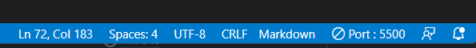

# Transpiler votre Typescript en Javascript

Regarder le fichier le plus à jour entre ce readme et le fichier Transpiler TypeScript en Javascript.md

## Méthode en ligne de commande (Pratique pour VSCode)

### Installation

Pour ce faire, nous aurons besoin de npm (Node Package Manager). Il est fourni avec l'installation de NodeJS

1. A la racide de votre projet de travail, installez TypeScript via npm 

```bash
    npm install ts --save-dev
```

Vous devriez avoir 3 nouveaux fichiers/dossiers s'il n'existaient pas (node_modules, package.json, package-lock.json)

2. Toujours, à la racine de votre projet, ajouter un fichier tsconfig.json avec ceci à l'intérieur

```js
{
    "compilerOptions": {
      "target": "es5",
      "module": "commonjs",
      "declaration": false,
      "noImplicitAny": false,
      "removeComments": true,
      "noLib": false,
      "sourceMap":true, // Important pour utiliser le debugger
      "outDir": "./public/js/", //Votre dossier ou sortira le JS
      "rootDir": "./src/ts/" //Votre dossier avec vos fichier TS
    },
    "exclude": ["node_modules", "**/*.spec.ts"]
}
```

Ce fichier peut être adapté à vos besoins/à votre archi de projet

3. Utilisez la commande TS suivante pour mettre votre terminal en mode surveillance. Il transpilera alors vos fichier lors d'une sauvegarde (et au lancement).

```bash
    npx tsc --watch
```

Vous pouvez arrêter le mode watch en fermant le terminal ou avec le raccourcis CTRL + C

### Utiliser le debugger de VSCode

Nous allons devoir configurer notre VSCode pour lancer notre fichier HTML principal. Pour cela, nous devons avoir un dossier nommé
.vscode à la racine de notre projet (Celui-ci pourrait déjà exister !)

A l'intérieur, créez ou modifier le fichier launch.json pour qu'il contienne les informations suivantes : 

```json
{

    "version": "0.2.0",
    "configurations": [
        {
            "type": "msedge",
            "request": "launch",
            "name": "Open index.html",            
            "webRoot": "${workspaceFolder}",
            "runtimeExecutable": "stable",
            "url": "http://localhost:5500/PATH-TO-YOUR-INDEX-HTML-FOLDER/"
        }
    ]
}
```

Pour pouvoir utiliser le server, vérifiez que vous aillez l'extension Live Server de Ritwick Dey d'activé dans votre VSC. Puis lancez le live server depuis votre fichier HTML (Click droit dans votre fichier > Open Live Server). 

Le port sur lequel il est lancé devrait être indiqué dans la barre coloré (souvent bleu ou violette) en bas à droite. Mettez à jour votre launch.json avec le bon port après localhost



Une fois cela fais, rendez-vous dans l'onglet Run & Debug (Un petit insect avec un triangle dans les onglets de gauche).
Vous aurez accès au bouton RUN (Triangle vert) dans le coin haut gauche de votre application.
Cliquez dessus, cela lancera une fenêtre Edge avec votre fichier. 

Vous devriez pouvoir mettre des breakpoints dans votre code TS ! Une fois lancé en mode débug, le programme s'arrêtera la où vouis l'avez souhaité ! Vous aurez même la console de votre navigateur dans l'onglet DEBUG CONSOLE de votre VSCode ! 

```text
    Sur Windows, le raccourcis pour aller dans l'onglet debug est Ctrl + Shift + D, puis pour run, il suffit d'appuyer sur F5
```

## Pour WebStorm

La doc est très explicite et je vous invite à la consulter (English Only)

[Documentation](https://www.jetbrains.com/help/webstorm/compiling-typescript-to-javascript.html)